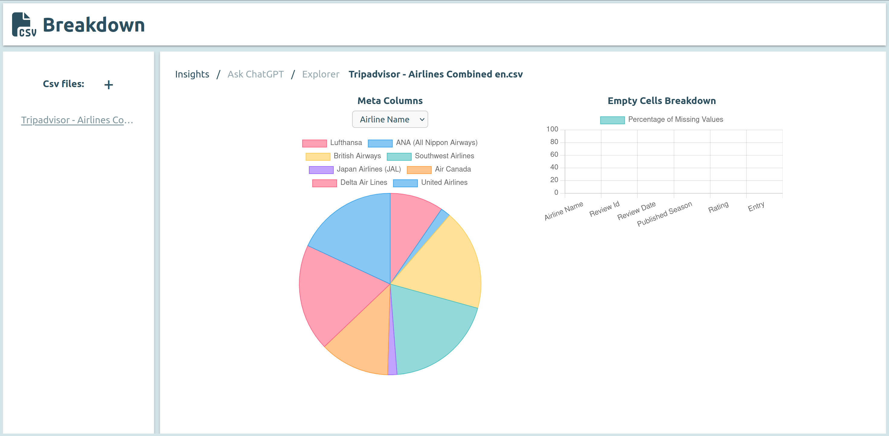
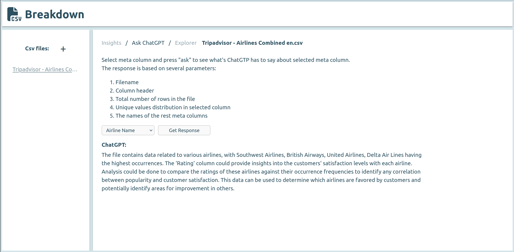
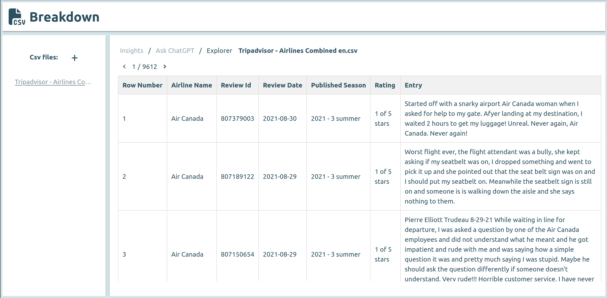

# CSV File Breakdown

**CSV File Breakdown** is a web application designed to help users gain insights into the contents of their CSV files. By uploading a CSV file, users can explore the data in detail through various interactive visualizations and tools.

## Features

### 1. Meta Columns Breakdown And Missing Values Analysis
Visualize unique values in each meta column with a **pie chart** to understand the distribution of categories and values within key columns.
Analyze data completeness with a **bar chart** showing the percentage of empty values for each column, providing insights into data quality across all column types.



### 2. Ask ChatGPT
Interact with ChatGPT using a predefined prompt based on meta column data and other relevant factors to gain AI-generated insights about your data.



### 3. Data Explorer
A table view component that displays the complete contents of the CSV file, allowing users to browse through the data in its entirety.



## Application Components

The application consists of three main components:

1. **Backend**: Python 3 with FastAPI
2. **Frontend**: Lit with Vite
3. **Database**: MongoDB

> **Note**: Currently, the application is not containerized, so each component needs to be set up and run manually.


## Installation:
### Prerequisites:
The "Ask ChatGPT" feature requires you to have [OpenAI developer platform](https://platform.openai.com/docs/overview) account. 

### MongoDB:

Installation guide of MongoDB Community for Ubuntu can be found [here](https://www.mongodb.com/docs/manual/tutorial/install-mongodb-on-ubuntu/). Make sure that 
you have a MongoDB instance available on "localhost" port "27017".
alternatively you can change db client set up in _**db.py**_ file.

## Installation:
### Backend:

Ensure that you have installed Python 3 at least 3.10.x version

1. cd into backend directory:
```bash
cd backend
```
2. create a virtual environment:
```bash
python3 -m venv venv
```
3. activate newly created virtual environment:
```bash
source venv/bin/activate
```
4. install dependencies:
```bash
pip install --upgrade pip wheel setuptools && pip install -r requirements.txt
```
5. Create **_.env_** file in backend directory and populate it with _**OPENAI_API_KEY=<your-api-key>**_ variable

### Frontend:

Ensure that you have installed NodeJS at least 18.20.x version and yarn at least 1.22.22 version

1. cd into frontend directory:
```bash
cd frontend
```
2. install dependencies:
```bash
yarn
```

## Run Application:
### Backend:
1. open separate terminal window and cd into backend directory:
```bash
cd backend
```
2. active virtual environment:
```bash
source venv/bin/activate
```
3. start uvicorn server:
```bash
uvicorn main:app --reload
```

### Frontend:

Ensure that you have installed NodeJS at least 18.20.x version and yarn at least 1.22.22 version

1. open separate terminal window and cd into frontend directory:
```bash
cd frontend
```
2. start vite server:
```bash
yarn dev
```
3. open application in browser: http://localhost:5173/

